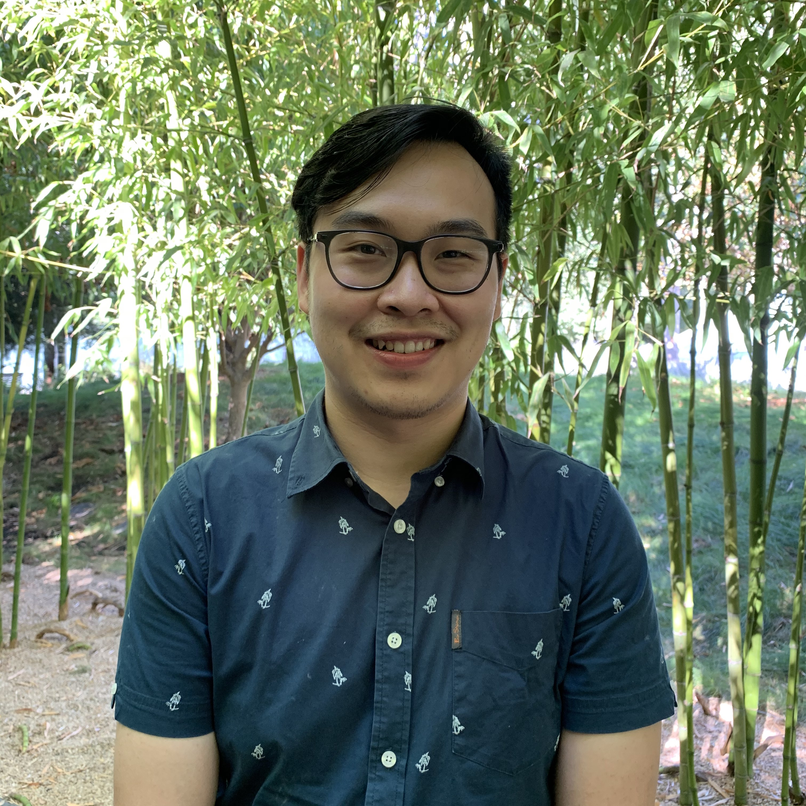

I am a civil engineer with a few years of experience in water resources and geospatial science - remote sensing, but taking a leap of faith into the field of data science.
Currently enrolled as a graduate student at the Master of Science in Data Science Program at University of San Francisco, I am eager to learn and 
specialize in data visualization and analysis, data engineering, and machine learning. I am passionate about using insights from data extraction to better understand trends and help making informed decisions. 
  
When I'm not coding or studying, I enjoy cooking, listening and playing music, and watching sports. 
